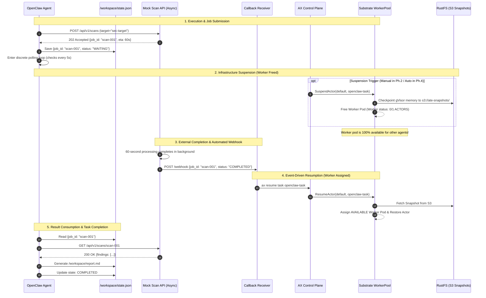
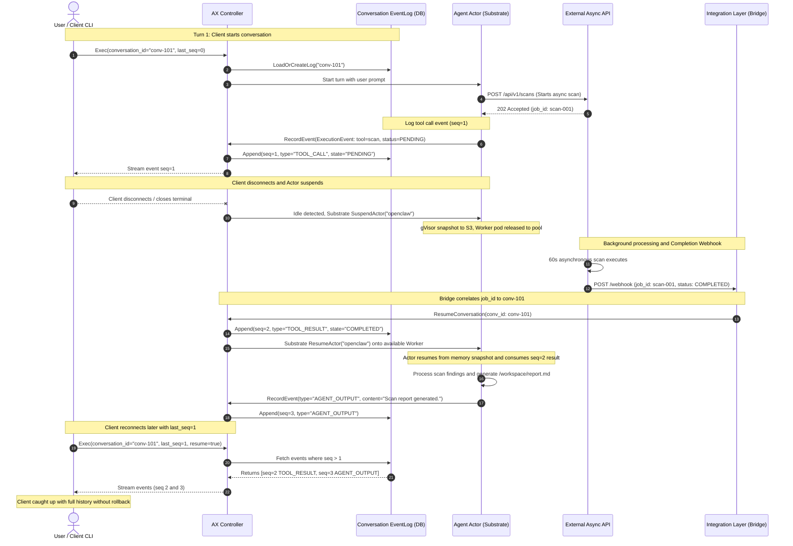

# Autonomous Agent Infrastructure Investigation: Google AX & Agent Substrate (ATE)

## Architecture, Implementation & Next Steps Guide

> [!NOTE]
> **Definitive Master Documentation Available:**
> For the complete architectural specification covering the multi-tool pipeline (`nmap` + external MCP + async scan), external Docker network integration, native `atenet-router` ingress resumption, and the full memory snapshot patch, see:
> [docs/AUTONOMOUS_ACTOR_MULTIPLEXING_ARCHITECTURE.md](docs/AUTONOMOUS_ACTOR_MULTIPLEXING_ARCHITECTURE.md).

---

## 1. Executive Summary & Investigation Goal

### 1.1 What We Are Investigating

> **The investigation focuses on whether Google AX and Agent Substrate (ATE) can suspend an externally waiting agent Actor, release its physical Worker, and later restore the Actor from a durable snapshot—without requiring agent-specific lifecycle or checkpointing code.**

### 1.2 Key Finding

Autonomous AI agents frequently encounter high-latency external dependencies (such as security scans, long-running batch jobs, CI/CD pipelines, or human-in-the-loop approvals) taking anywhere from 60 seconds to hours. With a conventional Kubernetes Pod, the agent remains scheduled while it waits, continuing to occupy CPU, memory, and other worker capacity even when it is not actively doing work.

This investigation looks at how **Google AX** (declarative agent task orchestrator) and **Agent Substrate** (hardware-virtualized, snapshot-capable actor runtime) handle this waiting period at the infrastructure layer:

* The agent workload (**OpenClaw**) remains completely unmodified and has zero Kubernetes or Substrate awareness.
* During external wait periods, AX suspends the task; Substrate checkpoints the entire gVisor sandbox to S3 and **releases the physical Worker back to the pool**.
* When the external dependency completes, an event callback automatically wakes the Actor, and Substrate restores its state from the durable snapshot onto **any available Worker in the pool**.

---

## 2. High-Level Architectural Topology

```
┌──────────────────────────────────────────────────────────────────────────────────────────────────┐
│                                 AUTONOMOUS AGENT LAYER (OpenClaw)                                │
│                                                                                                  │
│   • Pure Agent Logic & Autonomous Loop (Zero K8s / Substrate awareness)                          │
│   • Tool / API Invocations (Discrete HTTP requests; no open sockets held)                        │
│   • Durable Task Progress Tracking (/workspace/state.json)                                       │
└───────────────────────────────────────────────┬──────────────────────────────────────────────────┘
                                                │ Runs inside
                                                ▼
┌──────────────────────────────────────────────────────────────────────────────────────────────────┐
│                                   AX ORCHESTRATION LAYER (ax.io)                                 │
│                                                                                                  │
│   • Declares Workload Container, Commands & Environment (Task spec)                             │
│   • Persists /workspace across suspends & worker migrations (Workspace spec)                    │
│   • Coordinates Lifecycle Transitions (ax suspend / ax resume via ax-server & ax-controller)    │
└───────────────────────────────────────────────┬──────────────────────────────────────────────────┘
                                                │ Schedules as Actor
                                                ▼
┌──────────────────────────────────────────────────────────────────────────────────────────────────┐
│                                AGENT SUBSTRATE RUNTIME (ate.dev)                                 │
│                                                                                                  │
│   • Hardware-Isolated Sandboxes (gVisor runsc with KVM hardware virtualization)                  │
│   • Pooled Worker Scheduling (WorkerPool: 3 pre-warmed physical Worker Pods)                     │
│   • Full Sandbox State Snapshotting (Flushes memory & process tree to RustFS S3)                 │
│   • Worker Release on Suspend & Dynamic Worker Reassignment on Resume                            │
└───────────────────────┬──────────────────────────────────────────────────┬───────────────────────┘
                        │                                                  │
                        ▼ External API Request                             ▼ Webhook Callback
┌──────────────────────────────────────────────┐   ┌───────────────────────────────────────────────┐
│           MOCK EXTERNAL ASYNC API            │   │               CALLBACK RECEIVER               │
│                                              │   │                                               │
│ • Simulates 60s asynchronous scan job        │   │ • Lightweight integration bridge in ax-system │
│ • Returns 202 Accepted + job_id immediately  │──►│ • Listens for completion webhook              │
│ • Decoupled background processing            │   │ • Triggers AX Resume API (ax resume task)     │
└──────────────────────────────────────────────┘   └───────────────────────────────────────────────┘
```

---

## 3. Layer Breakdown & Component Responsibilities

| Layer                   | Component                           | Responsibility in Architecture                                                                                                                     | Modification Policy                                                  |
| :---------------------- | :---------------------------------- | :------------------------------------------------------------------------------------------------------------------------------------------------- | :------------------------------------------------------------------- |
| **Workload**            | `openclaw-agent`                    | Executes the autonomous task loop; queries target; invokes external scan tool; records progress in `/workspace/state.json`; consumes final result. | **Strictly Unmodified** (Zero lifecycle code, zero checkpoint calls) |
| **Supervisor**          | `ax-task-runner`                    | PID 1 container entrypoint; bootstraps `/workspace`; runs guest gRPC tunnel and readiness probe (`:80/readyz`).                                    | Upstream binary; wraps agent process cleanly.                        |
| **Control Plane**       | `ax-server` & `ax-controller`       | Declares Task and Workspace CRDs; tracks Redis state; exposes gRPC API; reconciles task lifecycle state machines.                                  | Configuration only (`ax-system`).                                    |
| **Runtime**             | `ate-api-server` & `ate-controller` | Manages Atespaces, ActorTemplates, Actor lifecycles, and network policies via mTLS SPIFFE.                                                         | Upstream Substrate control plane (`ate-system`).                     |
| **Compute Pool**        | `worker-pool` (3 pods)              | Hosts gVisor sandboxed Actors; manages local `runsc` processes; executes memory checkpoints.                                                       | Replicas = 3; `sandboxClass = gvisor`.                               |
| **Snapshot Store**      | `rustfs` (S3)                       | High-performance in-cluster S3 bucket (`s3://ate-snapshots/`) storing immutable actor memory snapshots.                                            | Deployed in `ate-system`.                                            |
| **External Dependency** | `mock-scan-api`                     | Decoupled asynchronous service simulating a long-running security scanner (60s delay; returns 202 Accepted).                                       | Test component deployed in `default` namespace.                      |
| **Event Bridge**        | `callback-receiver`                 | Receives HTTP webhook upon scan completion and invokes `ax resume task <name>`.                                                                    | Integration glue deployed in `ax-system`.                            |

---

## 4. End-to-End Decoupled Process Flow

The architecture strictly decouples the agent's process transport from the external dependency, ensuring that no open sockets are held across snapshot and worker migration boundaries:



---

## 5. AX Conversation Model, Event Log & Autonomous Suspend/Resume Architecture

### 5.1 What a "Conversation" Is in AX

In Google AX, the **Conversation** is the primary unit of execution, lifecycle management, and state tracking for an agent's interaction over time. Rather than treating an agent as a volatile Linux process or a simple request-response cycle, AX models every interaction as a durable, stateful event stream.

Key structural properties of an AX Conversation:

1. **Append-Only Event Log (`EventLog`)**:
   Every meaningful step—user prompts, model reasoning outputs, tool invocation dispatches, tool execution results, and lifecycle transitions—is recorded as an immutable event in an `EventLog`.
   * Current implementations persist this log into relational storage (SQLite for local workflows, PostgreSQL in distributed Kubernetes deployments).
   * Events are append-only; they cannot be mutated or deleted, guaranteeing complete auditability and deterministic replay.

2. **Globally Unique Identification (`conversation_id`)**:
   Every conversation is addressed by a UUID `conversation_id`. Clients pass this identifier when executing commands via CLI (`ax exec --conversation <id>`) or gRPC (`Exec(conversation_id, ...)`).

3. **Monotonically Increasing Sequence Numbers (`seq`)**:
   Each event appended to the log receives a strictly ordered sequence number (`seq = 1, 2, 3, ...`). This provides a synchronized logical clock between the client, the AX Controller, and the agent runtime.

4. **Replay as the Source of Truth**:
   The AX Controller reconstructs an agent's state by replaying its event log. When a client or agent disconnects or recovers from failure, the controller does not roll back state; it determines the delta (`seq > last_seq`) and streams missing events to achieve synchronization.

> [!NOTE]
> **Core Architectural Reference (AX Specifications)**:
> *"The Core Controller maintains the state of conversations via an append-only event log... Every message, tool result, and state change is appended to an EventLog. This allows the system to: Resume: Replay history to reconstruct state."*  
> *"Each Agent action (receiving a message, calling a tool, returning a result) is appended to the Event Log, forming an immutable timeline. Each event has a monotonically increasing sequence number; clients and agents use this to track progress."*

---

### 5.2 The Conceptual Triad: Agent vs. Task vs. Conversation

To prevent conflation between compute containers, workload manifests, and interaction timelines, AX enforces a clean separation of concerns:

| Concept | Nature | Abstraction Level | Primary Function & Lifecycle |
| :--- | :--- | :--- | :--- |
| **Agent** | Code / Logic | Application Layer | The software service implementing the autonomous loop (*reason $\rightarrow$ act $\rightarrow$ observe*). Can be remote or embedded; agnostic of infrastructure scheduling. |
| **Task** | Declarative Spec (YAML) | Orchestration Layer (CRD) | Defines *what* to run: container image, compute resources, tools, environment variables, and durable `/workspace` storage bindings. |
| **Conversation** | Event Stream & Timeline | Runtime State Layer | The runtime instance of an agent's interaction over time, recorded as an ordered event log. A single Task can host multiple sequential conversations or one continuous multi-turn timeline. |

#### Physical Execution vs. Logical Continuity
* **Physical Suspend/Resume (Substrate)** operates at the **Actor / Container level**: freezing gVisor sandbox memory, checkpointing process trees to S3, and freeing physical worker pods.
* **Logical Continuity (AX)** operates at the **Conversation level**: tracking progress via sequence numbers (`seq`), recording pending vs. completed tool events, and synchronizing distributed clients across disconnects.

---

### 5.3 Interaction with Suspend and Resume: Step-by-Step

When an autonomous agent initiates a long-running external API call, the AX conversation lifecycle unfolds as follows:

1. **Client Initiates or Resumes Conversation**:
   The client invokes `ax exec --conversation <id> [--last-seq N] [--resume]` or the gRPC `Exec()` API.
2. **Controller Prepares Event Stream**:
   The AX Controller loads the conversation's event log. If the client provided `last_seq`, the controller identifies all events with `seq > last_seq` to stream to the client.
3. **Agent Executes Turn & Dispatches External Tool**:
   The agent processes the turn, reasons, and invokes an external tool (e.g. security scan, batch job). This tool invocation is appended to the conversation log as an `ExecutionEvent` with state `PENDING`.
4. **Agent Enters Idle State & Substrate Suspends**:
   With no active CPU tasks remaining while awaiting the external operation, the agent actor enters an idle state. AX and Agent Substrate detect this idle state, snapshot the gVisor sandbox to S3, and release the physical worker pod back to the shared pool (`0/1` actors). The conversation remains securely stored in the event log.
5. **External Completion & Webhook Reception**:
   The external system finishes processing. Because network runtimes do not automatically inspect remote HTTP endpoints, an **integration layer** (such as our [receiver.py](file:///home/esha/Office/ax_substrate/mock-services/callback-receiver/receiver.py) / `lifecycle-controller`) receives the webhook callback and correlates the job result with the appropriate `conversation_id`.
6. **Controller Appends Result & Resumes Actor**:
   The integration layer passes the completed payload into AX. Substrate restores the Actor snapshot onto an available worker pod. The AX Controller appends the tool result as a new `ExecutionEvent` with state `COMPLETED` and advances `seq`.
7. **Agent Continues Loop**:
   The agent resumes execution from memory, consumes the completed tool result, and proceeds with its autonomous loop.
8. **Client Reconnects Later (Catch-Up via `last_seq`)**:
   If the human operator or client disconnected during the wait, they reconnect using:
   ```bash
   ax exec --conversation <id> --last-seq <old_seq> --resume
   ```
   The Controller replays only the newly generated events (`seq > old_seq`). The client "catches up" seamlessly without rolling back the server-side state.

---

### 5.4 The Autonomous Resume Mechanism & Integration Layer

The term **"autonomous"** in AX + Substrate does not imply that the infrastructure layer magically polls or inspects arbitrary third-party REST APIs. Rather, it represents a decoupled two-part contract:

1. **Automated Suspension**: Substrate automatically sheds physical worker capacity when an actor is blocked/idle awaiting an external response.
2. **Event-Driven Resumption via Integration Layer**: A lightweight event bridge receives external completion signals, correlates them to the target `conversation_id`, and instructs AX to resume the actor and append the tool result.

```
┌────────────────────────────────────────────────────────────────────────────────────────┐
│                              INTEGRATION LAYER CONTRACT                                │
│                                                                                        │
│   External Response Received ──► Correlate to conversation_id ──► Append COMPLETED Event │
│                                                                        │               │
│                                                                        ▼               │
│                                                                 ax resume task <name>   │
└────────────────────────────────────────────────────────────────────────────────────────┘
```

The runtime doesn't magically know "this HTTP call just returned"; you need a small integration layer that:
* Correlates responses to actors and conversations.
* Pushes the result event into AX.
* Calls the resume API when appropriate.

---

### 5.5 End-to-End Sequence: Client, Controller, Agent, and Callback Bridge



---

## 6. What Has Been Completed So Far

```
┌────────────────────────────────────────────────────────────────────────┐
│                        IMPLEMENTATION STATUS                           │
│                                                                        │
│   [✔] PHASE 1: Basic Actor Bring-Up                                │
│       • Containerized openclaw-agent with ax-task-runner               │
│       • Deployed mock-scan-api with 202 Accepted response              │
│       • Verified chain: OpenClaw → AX Task → Substrate Worker          │
│                                                                        │
│   [✔] PHASE 2: Manual Suspend / Resume                 │
│       • Suspended task during 60s external scan wait                   │
│       • Verified Worker Release: Worker dropped from 1/1 to 0/1        │
│       • Verified Snapshot flush to RustFS S3                           │
│       • Resumed task onto DIFFERENT Worker (10.244.0.28 → 10.244.0.27) │
│       • Verified exact single external job creation (total_jobs = 1)   │
│                                                                        │
│   [✔] PHASE 3: Event-Triggered Automated Resume                    │
│       • Deployed callback-receiver microservice in ax-system           │
│       • Mock API dispatched webhook upon 60s job completion            │
│       • callback-receiver executed AX Resume API automatically         │
│       • Zero human intervention on resume                              │
│                                                                        │
│   [ ] PHASE 4: Automated Suspension & Multi-Actor Density (NEXT)      │
│       • Automatic wait state detection → ax suspend                    │
│       • 5-Actor on 3-Worker resource density benchmark                 │
└────────────────────────────────────────────────────────────────────────┘
```

### 6.1 Verification Results (Phases 1, 2 & 3)

| Criterion                          | Target Requirement                          | Observed Result                                                    | Status     |
| :--------------------------------- | :------------------------------------------ | :----------------------------------------------------------------- | :--------- |
| **Worker Release on Suspend**      | Assigned Worker becomes `0/1` active actors | Worker dropped from `1/1` to `0/1` immediately upon `ax suspend`   | **PASSED** |
| **Durable State Snapshot**         | Memory & process tree flushed to S3         | Snapshot confirmed at `s3://ate-snapshots/atespaces/default/...`   | **PASSED** |
| **Available Worker Placement**     | Resumed Actor placed onto available worker  | Restored on Worker 3 (`mnshm`) in Ph.2, Worker 2 (`8b9vz`) in Ph.3 | **PASSED** |
| **Single External Job Submission** | Exactly 1 job created; zero duplicates      | Mock API audit log confirmed `total_jobs: 1` throughout            | **PASSED** |
| **State Continuity**               | `/workspace` survives worker migration      | `/workspace/state.json` intact; `report.md` generated cleanly      | **PASSED** |
| **Automated Resumption**           | Resume triggered via external API webhook   | `mock-scan-api` webhook triggered `callback-receiver` in 15ms      | **PASSED** |
| **OpenClaw Code Purity**           | Zero k8s/AX lifecycle code in OpenClaw      | Standard Python agent loop; zero AX imports                        | **PASSED** |

---

## 7. What Is To Be Done Next: Phase 4 Implementation Plan

Phase 4 focuses on the remaining implementation goals:

1. **Automated Suspension:** Remove the manual `ax suspend` trigger by detecting when the agent enters `WAITING_FOR_EXTERNAL_API`.
2. **Multi-Actor Resource Density:** Check whether **5 concurrent logical agents** can be sustained on a **3-pod physical WorkerPool** through interleaving and dynamic worker reuse.

---

## 8. Phase 4 Architecture & Resource Density

### 8.1 Automated Waiting Detection

Instead of modifying OpenClaw to call `ax suspend` (which would violate workload neutrality), the waiting state is observed by an external lifecycle controller:

```
┌─────────────────────────────────────────────────────────────────────────┐
│                     AUTOMATED SUSPENSION MECHANISMS                     │
│                                                                         │
│   Option A: Notification Hook from External Mock API (Recommended)     │
│   • When OpenClaw calls POST /api/v1/scans, the Mock API returns 202    │
│     and immediately dispatches an asynchronous event:                   │
│     POST http://lifecycle-controller:8080/events                        │
│     {"event": "TASK_WAITING", "task": "openclaw-1", "job_id": "..."}    │
│   • The Lifecycle Controller calls ax suspend task openclaw-1.          │
│   • Completely transparent to OpenClaw; zero agent changes.             │
│                                                                         │
│   Option B: Workspace Status Observer                                  │
│   • A lightweight DaemonSet/sidecar observes /workspace/state.json      │
│   • When status == "WAITING_FOR_EXTERNAL_API", it fires ax suspend.     │
└─────────────────────────────────────────────────────────────────────────┘
```

---

### 8.2 Multi-Actor Resource Density (5 Actors on 3 Workers)

In standard Kubernetes, running 5 agent pods on 3 workers causes **pod pending starvation** (Pod 4 and Pod 5 cannot start until Pods 1–3 terminate).

With AX + Substrate actor suspension, suspended actors release their physical worker pods, enabling **dynamic compute multiplexing**:

```
TIME ────────────────────────────────────────────────────────────────────────►

Workers (Physical Capacity = 3)
┌───────────┐   ┌─────────────────┐   ┌─────────────────┐   ┌────────────────┐
│ Worker 1  │   │ Actor 1: RUN    │   │ Actor 4: RUN    │   │ Actor 1: RESUME│
└───────────┘   └────────┬────────┘   └────────▲────────┘   └────────▲───────┘
                         │ Wait/Suspend        │ Assigned            │ Callback
                         ▼                     │                     │
┌───────────┐   ┌─────────────────┐   ┌────────┴────────┐   ┌────────┴───────┐
│ Worker 2  │   │ Actor 2: RUN    │   │ Actor 5: RUN    │   │ Actor 2: RESUME│
└───────────┘   └────────┬────────┘   └────────▲────────┘   └────────▲───────┘
                         │ Wait/Suspend        │ Assigned            │ Callback
                         ▼                     │                     │
┌───────────┐   ┌─────────────────┐            │                     │
│ Worker 3  │   │ Actor 3: RUN    │────────────┼─────────────────────┼───────►
└───────────┘   └─────────────────┘            │                     │
                                               │                     │
Substrate S3                                   │                     │
┌───────────┐   ┌─────────────────┐            │                     │
│ Snapshots │   │ Actor 1 Snapshot│────────────┘                     │
│ (RustFS)  │   │ Actor 2 Snapshot│──────────────────────────────────┘
└───────────┘   └─────────────────┘
```

#### The Density Multiplier

* Physical Worker Pods: **3**
* Active / Logical Agent Actors: **5** (`openclaw-1` through `openclaw-5`)
* Potential Density Ratio: **$1.67\times$**
* **Effective Worker Occupancy Savings:**
  \(\text{Savings} = 1 - \frac{\sum T_{\text{active}}}{\sum T_{\text{wall\_clock}}} \ge 60\%\)

---

## 9. Step-by-Step Phase 4 Implementation

### Step 1: Deploy Lifecycle Controller for Automated Suspension

Deploy `mock-services/lifecycle-controller`:

* Combines `callback-receiver` with automated suspension.
* Exposes:

  * `POST /events/waiting` $\rightarrow$ calls `ax suspend task <name>`.
  * `POST /events/completed` $\rightarrow$ calls `ax resume task <name>`.

### Step 2: Configure Mock API for Automated Wait Signaling

Update `mock-scan-api`:

* On `POST /api/v1/scans`: immediately dispatches `TASK_WAITING` event to Lifecycle Controller.
* After 60s background scan: dispatches `TASK_COMPLETED` event to Lifecycle Controller.

### Step 3: Deploy 5 OpenClaw Tasks

Generate and apply manifests for 5 OpenClaw tasks:

* `openclaw-1`, `openclaw-2`, `openclaw-3`, `openclaw-4`, `openclaw-5`.
* Apply all 5 tasks simultaneously.

### Step 4: Run Automated Density Benchmark

1. Observe Tasks 1, 2, and 3 claim the 3 Workers.
2. Tasks 1, 2, and 3 submit external scans and immediately transition to `Suspended`.
3. Workers 1, 2, and 3 become available (`0/1` actors).
4. Substrate schedules Tasks 4 and 5 onto the newly available Workers without queue starvation.
5. As scans complete, webhooks trigger automatic resumption; tasks finish and write reports.

### Step 5: Generate Quantitative Resource Efficiency Report

Measure:

* Total Worker-seconds occupied (Baseline vs. AX/Substrate Optimized).
* Maximum concurrent Actors sustained.
* Average Suspend and Resume latency.

---

## 10. Verified Insights from Community Discussions

Recent engineering discussions within the AX developer community have clarified key aspects of the runtime architecture, operational semantics, and security boundaries:

### 10.1 Discussion 1: AX Gateway Security & External Policy Engine Integration (PEP vs. PDP)

* **Topic & Community Inquiry**:
  Clarifying the scope of AX's **"Swappable Google-Managed Gateway"** roadmap item—specifically whether "swappable" only refers to substituting alternative Google-provided gateway implementations, or whether it provides an extensible hook for external policy engines.
* **Core Architectural Questions**:
  1. *Interception Hook*: Does AX provide an interception hook before an outbound request exits the sandbox, beyond static host/port allowlists?
  2. *Abstraction Boundary*: Is the gateway abstraction bounded at **L4 network policy** (host/port allow/deny rules) or at **L7 action-level policy decisions** (inspecting request semantics, action types, target endpoints, and tool payloads via an external Policy Decision Point)?
* **Key Distinctions**:
  * **PEP (Policy Enforcement Point)**: The AX Gateway component acting as the network proxy that blocks or allows outbound agent traffic.
  * **PDP (Policy Decision Point)**: An external policy authority (e.g. Open Policy Agent / OPA, enterprise compliance webhooks, or gRPC governance services) that evaluates fine-grained authorization rules.
* **Verified Status**:
  AX's current Gateway implementation enforces declarative **L4 static allowlists** (configured via host and port rules). While enterprise use cases with deterministic action-level policy layers require L7 PDP integration hooks, this remains an architectural design boundary under active discussion.

---

### 10.2 Discussion 2: Long-Lived Resumable Agent Services on Kubernetes & Disconnect/Reconnect

* **Topic & Community Inquiry**:
  Clarifying the runtime execution model of AX agents deployed on Kubernetes: whether an AX task behaves as an ephemeral batch job (which terminates when the CLI client disconnects) or as a long-lived, persistent service. Specifically, if a user port-forwards the AX server, starts an agent, and closes the terminal, does the agent continue running, and can the user reconnect later?
* **Verified Architectural Behavior**:
  * **Stateful Actor Model**: AX agents are explicitly designed as stateful actors running on Agent Substrate rather than short-lived Kubernetes batch jobs (`Batch/v1 Job`).
  * **Autonomous Server-Side Persistence**: The agent task and its conversation event log persist on the server side completely independent of client connections or port-forwards.
  * **Reconnection & Catch-Up Mechanism**:
    A client can disconnect at any point and subsequently reconnect using:
    ```bash
    ax exec --conversation <conversation-id> --last-seq <seq> --resume
    ```
    The AX Controller reconciles the client with the server-side event log by streaming only events with `seq > last_seq`. This is **not a rollback**; the agent continues executing on the cluster, and the client simply catches up with events generated during the disconnected period.
* **Community Consensus**:
  The observed behavior matches AX's core design philosophy (long-running, durable, resumable conversations on Substrate). However, community discussions emphasize the need for more explicit, centralized documentation distinguishing this actor model from standard Kubernetes job conventions.

---

## 11. File & Directory Reference

```
/home/esha/Office/ax_substrate/
├── openclaw/
│   ├── Dockerfile                                 # OpenClaw agent image based on ax-task-runner
│   ├── agent/
│   │   └── openclaw_agent.py                      # Unmodified autonomous agent task loop
│   └── deploy/
│       ├── openclaw-task.yaml                     # Single AX Task manifest (Phase 1-3)
│       └── openclaw-task.template.yaml            # Template for multi-agent density test
├── mock-services/
│   ├── scan-api/
│   │   ├── main.py                                # Asynchronous scan API + webhook dispatcher
│   │   ├── Dockerfile
│   │   └── deploy.yaml                            # Deployed in default namespace
│   └── callback-receiver/
│       ├── receiver.py                            # Webhook listener -> ax resume translator
│       ├── Dockerfile
│       └── deploy.yaml                            # Deployed in ax-system namespace
├── docs/
│   ├── EXPERIMENT_RESULTS_PHASE1_PHASE2.md        # Detailed verification logs for Phase 1 & 2
│   └── EXPERIMENT_RESULTS_PHASE3.md               # Detailed verification logs for Phase 3
└── ARCHITECTURE_AND_VALIDATION_GUIDE.md           # Root architectural reference
```

