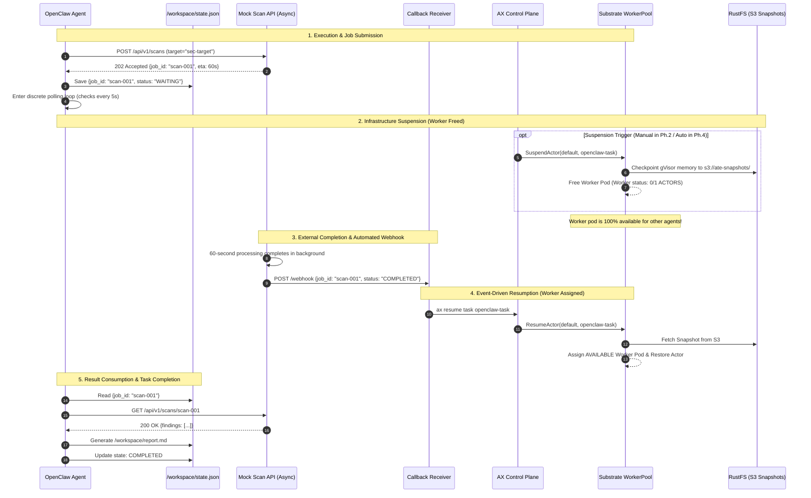

# Autonomous Agent Infrastructure Investigation: Google AX & Agent Substrate (ATE)

## Architecture, Implementation & Next Steps Guide

---

## 1. Executive Summary & Investigation Goal

### 1.1 What We Are Investigating

> **The investigation focuses on whether Google AX and Agent Substrate (ATE) can suspend an externally waiting agent Actor, release its physical Worker, and later restore the Actor from a durable snapshot—without requiring agent-specific lifecycle or checkpointing code.**

### 1.2 Key Finding

Autonomous AI agents frequently encounter high-latency external dependencies (such as security scans, long-running batch jobs, CI/CD pipelines, or human-in-the-loop approvals) taking anywhere from 60 seconds to hours. With a conventional Kubernetes Pod, the agent remains scheduled while it waits, continuing to occupy CPU, memory, and other worker capacity even when it is not actively doing work.

This investigation looks at how **Google AX** (declarative agent task orchestrator) and **Agent Substrate** (hardware-virtualized, snapshot-capable actor runtime) handle this waiting period at the infrastructure layer:

* The agent workload (**OpenClaw**) remains completely unmodified and has zero Kubernetes or Substrate awareness.
* During external wait periods, AX suspends the task; Substrate checkpoints the entire gVisor sandbox to S3 and **releases the physical Worker back to the pool**.
* When the external dependency completes, an event callback automatically wakes the Actor, and Substrate restores its state from the durable snapshot onto **any available Worker in the pool**.

---

## 2. High-Level Architectural Topology

```
┌──────────────────────────────────────────────────────────────────────────────────────────────────┐
│                                 AUTONOMOUS AGENT LAYER (OpenClaw)                                │
│                                                                                                  │
│   • Pure Agent Logic & Autonomous Loop (Zero K8s / Substrate awareness)                          │
│   • Tool / API Invocations (Discrete HTTP requests; no open sockets held)                        │
│   • Durable Task Progress Tracking (/workspace/state.json)                                       │
└───────────────────────────────────────────────┬──────────────────────────────────────────────────┘
                                                │ Runs inside
                                                ▼
┌──────────────────────────────────────────────────────────────────────────────────────────────────┐
│                                   AX ORCHESTRATION LAYER (ax.io)                                 │
│                                                                                                  │
│   • Declares Workload Container, Commands & Environment (Task spec)                             │
│   • Persists /workspace across suspends & worker migrations (Workspace spec)                    │
│   • Coordinates Lifecycle Transitions (ax suspend / ax resume via ax-server & ax-controller)    │
└───────────────────────────────────────────────┬──────────────────────────────────────────────────┘
                                                │ Schedules as Actor
                                                ▼
┌──────────────────────────────────────────────────────────────────────────────────────────────────┐
│                                AGENT SUBSTRATE RUNTIME (ate.dev)                                 │
│                                                                                                  │
│   • Hardware-Isolated Sandboxes (gVisor runsc with KVM hardware virtualization)                  │
│   • Pooled Worker Scheduling (WorkerPool: 3 pre-warmed physical Worker Pods)                     │
│   • Full Sandbox State Snapshotting (Flushes memory & process tree to RustFS S3)                 │
│   • Worker Release on Suspend & Dynamic Worker Reassignment on Resume                            │
└───────────────────────┬──────────────────────────────────────────────────┬───────────────────────┘
                        │                                                  │
                        ▼ External API Request                             ▼ Webhook Callback
┌──────────────────────────────────────────────┐   ┌───────────────────────────────────────────────┐
│           MOCK EXTERNAL ASYNC API            │   │               CALLBACK RECEIVER               │
│                                              │   │                                               │
│ • Simulates 60s asynchronous scan job        │   │ • Lightweight integration bridge in ax-system │
│ • Returns 202 Accepted + job_id immediately  │──►│ • Listens for completion webhook              │
│ • Decoupled background processing            │   │ • Triggers AX Resume API (ax resume task)     │
└──────────────────────────────────────────────┘   └───────────────────────────────────────────────┘
```

---

## 3. Layer Breakdown & Component Responsibilities

| Layer                   | Component                           | Responsibility in Architecture                                                                                                                     | Modification Policy                                                  |
| :---------------------- | :---------------------------------- | :------------------------------------------------------------------------------------------------------------------------------------------------- | :------------------------------------------------------------------- |
| **Workload**            | `openclaw-agent`                    | Executes the autonomous task loop; queries target; invokes external scan tool; records progress in `/workspace/state.json`; consumes final result. | **Strictly Unmodified** (Zero lifecycle code, zero checkpoint calls) |
| **Supervisor**          | `ax-task-runner`                    | PID 1 container entrypoint; bootstraps `/workspace`; runs guest gRPC tunnel and readiness probe (`:80/readyz`).                                    | Upstream binary; wraps agent process cleanly.                        |
| **Control Plane**       | `ax-server` & `ax-controller`       | Declares Task and Workspace CRDs; tracks Redis state; exposes gRPC API; reconciles task lifecycle state machines.                                  | Configuration only (`ax-system`).                                    |
| **Runtime**             | `ate-api-server` & `ate-controller` | Manages Atespaces, ActorTemplates, Actor lifecycles, and network policies via mTLS SPIFFE.                                                         | Upstream Substrate control plane (`ate-system`).                     |
| **Compute Pool**        | `worker-pool` (3 pods)              | Hosts gVisor sandboxed Actors; manages local `runsc` processes; executes memory checkpoints.                                                       | Replicas = 3; `sandboxClass = gvisor`.                               |
| **Snapshot Store**      | `rustfs` (S3)                       | High-performance in-cluster S3 bucket (`s3://ate-snapshots/`) storing immutable actor memory snapshots.                                            | Deployed in `ate-system`.                                            |
| **External Dependency** | `mock-scan-api`                     | Decoupled asynchronous service simulating a long-running security scanner (60s delay; returns 202 Accepted).                                       | Test component deployed in `default` namespace.                      |
| **Event Bridge**        | `callback-receiver`                 | Receives HTTP webhook upon scan completion and invokes `ax resume task <name>`.                                                                    | Integration glue deployed in `ax-system`.                            |

---

## 4. End-to-End Decoupled Process Flow

The architecture strictly decouples the agent's process transport from the external dependency, ensuring that no open sockets are held across snapshot and worker migration boundaries:



---

## 5. What Has Been Completed So Far

```
┌────────────────────────────────────────────────────────────────────────┐
│                        IMPLEMENTATION STATUS                           │
│                                                                        │
│   [✔] PHASE 1: Basic Actor Bring-Up                                │
│       • Containerized openclaw-agent with ax-task-runner               │
│       • Deployed mock-scan-api with 202 Accepted response              │
│       • Verified chain: OpenClaw → AX Task → Substrate Worker          │
│                                                                        │
│   [✔] PHASE 2: Manual Suspend / Resume                 │
│       • Suspended task during 60s external scan wait                   │
│       • Verified Worker Release: Worker dropped from 1/1 to 0/1        │
│       • Verified Snapshot flush to RustFS S3                           │
│       • Resumed task onto DIFFERENT Worker (10.244.0.28 → 10.244.0.27) │
│       • Verified exact single external job creation (total_jobs = 1)   │
│                                                                        │
│   [✔] PHASE 3: Event-Triggered Automated Resume                    │
│       • Deployed callback-receiver microservice in ax-system           │
│       • Mock API dispatched webhook upon 60s job completion            │
│       • callback-receiver executed AX Resume API automatically         │
│       • Zero human intervention on resume                              │
│                                                                        │
│   [ ] PHASE 4: Automated Suspension & Multi-Actor Density (NEXT)      │
│       • Automatic wait state detection → ax suspend                    │
│       • 5-Actor on 3-Worker resource density benchmark                 │
└────────────────────────────────────────────────────────────────────────┘
```

### 5.1 Verification Results (Phases 1, 2 & 3)

| Criterion                          | Target Requirement                          | Observed Result                                                    | Status     |
| :--------------------------------- | :------------------------------------------ | :----------------------------------------------------------------- | :--------- |
| **Worker Release on Suspend**      | Assigned Worker becomes `0/1` active actors | Worker dropped from `1/1` to `0/1` immediately upon `ax suspend`   | **PASSED** |
| **Durable State Snapshot**         | Memory & process tree flushed to S3         | Snapshot confirmed at `s3://ate-snapshots/atespaces/default/...`   | **PASSED** |
| **Available Worker Placement**     | Resumed Actor placed onto available worker  | Restored on Worker 3 (`mnshm`) in Ph.2, Worker 2 (`8b9vz`) in Ph.3 | **PASSED** |
| **Single External Job Submission** | Exactly 1 job created; zero duplicates      | Mock API audit log confirmed `total_jobs: 1` throughout            | **PASSED** |
| **State Continuity**               | `/workspace` survives worker migration      | `/workspace/state.json` intact; `report.md` generated cleanly      | **PASSED** |
| **Automated Resumption**           | Resume triggered via external API webhook   | `mock-scan-api` webhook triggered `callback-receiver` in 15ms      | **PASSED** |
| **OpenClaw Code Purity**           | Zero k8s/AX lifecycle code in OpenClaw      | Standard Python agent loop; zero AX imports                        | **PASSED** |

---

## 6. What Is To Be Done Next: Phase 4 Implementation Plan

Phase 4 focuses on the remaining implementation goals:

1. **Automated Suspension:** Remove the manual `ax suspend` trigger by detecting when the agent enters `WAITING_FOR_EXTERNAL_API`.
2. **Multi-Actor Resource Density:** Check whether **5 concurrent logical agents** can be sustained on a **3-pod physical WorkerPool** through interleaving and dynamic worker reuse.

---

## 7. Phase 4 Architecture & Resource Density

### 7.1 Automated Waiting Detection

Instead of modifying OpenClaw to call `ax suspend` (which would violate workload neutrality), the waiting state is observed by an external lifecycle controller:

```
┌─────────────────────────────────────────────────────────────────────────┐
│                     AUTOMATED SUSPENSION MECHANISMS                     │
│                                                                         │
│   Option A: Notification Hook from External Mock API (Recommended)     │
│   • When OpenClaw calls POST /api/v1/scans, the Mock API returns 202    │
│     and immediately dispatches an asynchronous event:                   │
│     POST http://lifecycle-controller:8080/events                        │
│     {"event": "TASK_WAITING", "task": "openclaw-1", "job_id": "..."}    │
│   • The Lifecycle Controller calls ax suspend task openclaw-1.          │
│   • Completely transparent to OpenClaw; zero agent changes.             │
│                                                                         │
│   Option B: Workspace Status Observer                                  │
│   • A lightweight DaemonSet/sidecar observes /workspace/state.json      │
│   • When status == "WAITING_FOR_EXTERNAL_API", it fires ax suspend.     │
└─────────────────────────────────────────────────────────────────────────┘
```

---

### 7.2 Multi-Actor Resource Density (5 Actors on 3 Workers)

In standard Kubernetes, running 5 agent pods on 3 workers causes **pod pending starvation** (Pod 4 and Pod 5 cannot start until Pods 1–3 terminate).

With AX + Substrate actor suspension, suspended actors release their physical worker pods, enabling **dynamic compute multiplexing**:

```
TIME ────────────────────────────────────────────────────────────────────────►

Workers (Physical Capacity = 3)
┌───────────┐   ┌─────────────────┐   ┌─────────────────┐   ┌────────────────┐
│ Worker 1  │   │ Actor 1: RUN    │   │ Actor 4: RUN    │   │ Actor 1: RESUME│
└───────────┘   └────────┬────────┘   └────────▲────────┘   └────────▲───────┘
                         │ Wait/Suspend        │ Assigned            │ Callback
                         ▼                     │                     │
┌───────────┐   ┌─────────────────┐   ┌────────┴────────┐   ┌────────┴───────┐
│ Worker 2  │   │ Actor 2: RUN    │   │ Actor 5: RUN    │   │ Actor 2: RESUME│
└───────────┘   └────────┬────────┘   └────────▲────────┘   └────────▲───────┘
                         │ Wait/Suspend        │ Assigned            │ Callback
                         ▼                     │                     │
┌───────────┐   ┌─────────────────┐            │                     │
│ Worker 3  │   │ Actor 3: RUN    │────────────┼─────────────────────┼───────►
└───────────┘   └─────────────────┘            │                     │
                                               │                     │
Substrate S3                                   │                     │
┌───────────┐   ┌─────────────────┐            │                     │
│ Snapshots │   │ Actor 1 Snapshot│────────────┘                     │
│ (RustFS)  │   │ Actor 2 Snapshot│──────────────────────────────────┘
└───────────┘   └─────────────────┘
```

#### The Density Multiplier

* Physical Worker Pods: **3**
* Active / Logical Agent Actors: **5** (`openclaw-1` through `openclaw-5`)
* Potential Density Ratio: **$1.67\times$**
* **Effective Worker Occupancy Savings:**
  \(\text{Savings} = 1 - \frac{\sum T_{\text{active}}}{\sum T_{\text{wall\_clock}}} \ge 60\%\)

---

## 8. Step-by-Step Phase 4 Implementation

### Step 1: Deploy Lifecycle Controller for Automated Suspension

Deploy `mock-services/lifecycle-controller`:

* Combines `callback-receiver` with automated suspension.
* Exposes:

  * `POST /events/waiting` $\rightarrow$ calls `ax suspend task <name>`.
  * `POST /events/completed` $\rightarrow$ calls `ax resume task <name>`.

### Step 2: Configure Mock API for Automated Wait Signaling

Update `mock-scan-api`:

* On `POST /api/v1/scans`: immediately dispatches `TASK_WAITING` event to Lifecycle Controller.
* After 60s background scan: dispatches `TASK_COMPLETED` event to Lifecycle Controller.

### Step 3: Deploy 5 OpenClaw Tasks

Generate and apply manifests for 5 OpenClaw tasks:

* `openclaw-1`, `openclaw-2`, `openclaw-3`, `openclaw-4`, `openclaw-5`.
* Apply all 5 tasks simultaneously.

### Step 4: Run Automated Density Benchmark

1. Observe Tasks 1, 2, and 3 claim the 3 Workers.
2. Tasks 1, 2, and 3 submit external scans and immediately transition to `Suspended`.
3. Workers 1, 2, and 3 become available (`0/1` actors).
4. Substrate schedules Tasks 4 and 5 onto the newly available Workers without queue starvation.
5. As scans complete, webhooks trigger automatic resumption; tasks finish and write reports.

### Step 5: Generate Quantitative Resource Efficiency Report

Measure:

* Total Worker-seconds occupied (Baseline vs. AX/Substrate Optimized).
* Maximum concurrent Actors sustained.
* Average Suspend and Resume latency.

---

## 9. File & Directory Reference

```
/home/berrybytes/Office/AX_Substrtate/
├── openclaw/
│   ├── Dockerfile                                 # OpenClaw agent image based on ax-task-runner
│   ├── agent/
│   │   └── openclaw_agent.py                      # Unmodified autonomous agent task loop
│   └── deploy/
│       ├── openclaw-task.yaml                     # Single AX Task manifest (Phase 1-3)
│       └── openclaw-task.template.yaml            # Template for multi-agent density test
├── mock-services/
│   ├── scan-api/
│   │   ├── main.py                                # Asynchronous scan API + webhook dispatcher
│   │   ├── Dockerfile
│   │   └── deploy.yaml                            # Deployed in default namespace
│   └── callback-receiver/
│       ├── receiver.py                            # Webhook listener -> ax resume translator
│       ├── Dockerfile
│       └── deploy.yaml                            # Deployed in ax-system namespace
├── docs/
│   ├── EXPERIMENT_RESULTS_PHASE1_PHASE2.md        # Detailed verification logs for Phase 1 & 2
│   ├── EXPERIMENT_RESULTS_PHASE3.md               # Detailed verification logs for Phase 3
│   └── ARCHITECTURE_AND_VALIDATION_GUIDE.md       # This comprehensive guide
└── ARCHITECTURE_AND_VALIDATION_GUIDE.md           # Root architectural reference
```
